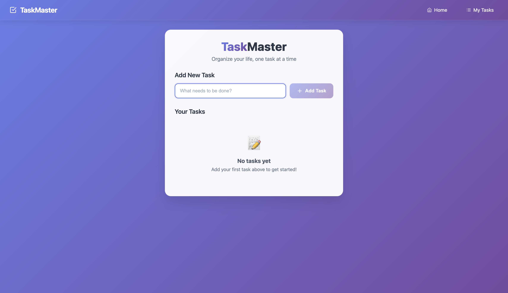

# 📝 React Todo App

A simple and interactive **Todo List Application** built with **ReactJS** to manage daily tasks efficiently.  
This app allows users to **add, edit, delete, and mark tasks as completed** with a clean and responsive UI.

---

## 🚀 Features
- ➕ **Add New Tasks** — Easily add tasks to your to-do list.
- ✏️ **Edit Tasks** — Update your task details anytime.
- ✅ **Mark as Complete** — Strike through tasks when done.
- ❌ **Delete Tasks** — Remove tasks you no longer need.
- 📱 **Responsive Design** — Works smoothly on mobile and desktop.

---

## 🛠️ Tech Stack
- **ReactJS** (Frontend)
- **CSS / TailwindCSS** (Styling)
- **JavaScript** (Logic)

---

## 📦 Installation & Setup

1. **Clone the repository**
   ```bash
   git clone https://github.com/Kunal1905/todo-app.git
